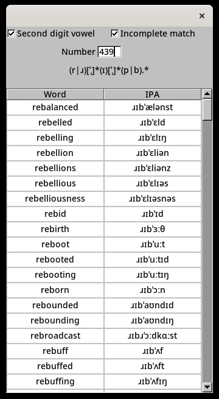

# What is this?

An app to create Major System memory peg images.  
It can do Consonant/Consonant/Consonant or Consonant/Vowel/Consonant, currently for a british english word list.  
Must be launched from same directory as the ipa txt file.  

